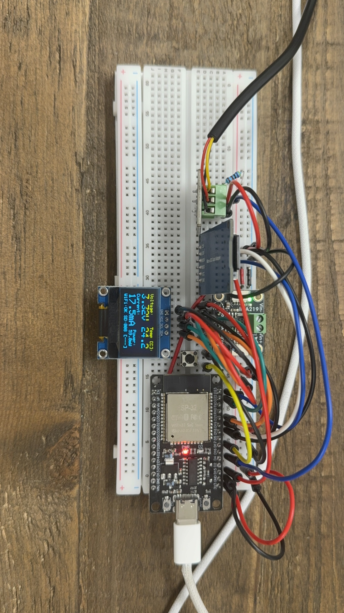

# project-03-sensor-datalogger
Multi-sensor data logging platform with live WiFi dashboard and on-demand SD card logging.

COMPLETE ✅

Goal: Extend the ESP32 measurement platform from Project 2 by adding a DS18B20 temperature sensor and microSD card logging. Stream live INA219 + temperature data to a Flask web dashboard with real-time Chart.js plots and direct SD card file downloads. Add a physical button to start/stop logging sessions — each session writes to a new NTP-timestamped CSV file with a persistent session counter.

I learned:
- SPI and I2C coexisting on the same ESP32 with multiple devices on each bus.
- Why the Arduino SD library is unreliable on ESP32 and how SdFat at a lower SPI clock rate solves it.
- The AMS1117 3.3V regulator on cheap HiLetgo SD modules requires 5V input — powering from ESP32's 3.3V pin causes silent SD init failures.
- GPIO 2 on the ESP32 is a strapping pin sampled at boot; using it for button input causes spurious boot behavior. GPIO 17 is the correct choice.
- NTP time sync over WiFi for timestamped filenames without an RTC module.
- The INA219 internal power register has 2mW quantization and uses VIN- rather than bus voltage; computing `busV * currentMA` in firmware is more accurate.
- Building a Flask + Chart.js live dashboard with a UDP receiver thread and HTTP file proxy for SD card downloads.
- Button debouncing in firmware and long-press detection for a secondary function (OLED freeze for photography).

How to flash:
- Board: ESP32 Dev Module
- Upload Speed: 115200 baud
- Hold BOOT button if upload fails at "Connecting..."
- Libraries: SdFat (Bill Greiman), Adafruit INA219, Adafruit SSD1306, Adafruit GFX, DallasTemperature, OneWire — all via Library Manager
- Edit `SSID`, `PASSWORD`, and `LAPTOP_IP` in the config block at the top of the sketch before uploading

How to run dashboard:
- Requires Python 3: `pip install flask requests`
- Run `python3 software/dashboard.py` before powering the ESP32
- Open `http://localhost:5000` in a browser
- Live plots update at 1 Hz; click Refresh in the files panel to list and download SD card logs
- macOS: disable AirPlay Receiver in System Settings → General → AirDrop & Handoff if port 5000 is in use
- Stop with Ctrl+C

BOM:
| Part | Value / Part # | Qty | Notes |
|------|----------------|-----|-------|
| Microcontroller | ESP32-D0WD-V3 dev board | 1 | - |
| Current/voltage sensor | INA219 breakout | 1 | I2C |
| Temperature sensor | DS18B20 TO-92 | 1 | 1-Wire; requires 4.7kΩ pull-up to 3.3V |
| Display | SSD1306 0.96" bi-color OLED (I2C) | 1 | - |
| microSD module | HiLetgo SPI module | 1 | AMS1117 + 74LVC125A onboard; must be powered from 5V |
| Resistor | 4.7kΩ | 1 | DS18B20 1-Wire pull-up |
| Button | Tactile pushbutton | 1 | GPIO 17, active-low |
| Misc | Breadboard + jumper wires | - | - |

Wiring:
| ESP32 Pin | Connected to |
|-----------|--------------|
| 3.3V | INA219 VCC, SSD1306 VCC, DS18B20 VCC |
| 5V (VIN) | SD module VCC |
| GND | All GND |
| GPIO 21 (SDA) | INA219 SDA, SSD1306 SDA |
| GPIO 22 (SCL) | INA219 SCL, SSD1306 SCL |
| GPIO 4 | DS18B20 DATA (+ 4.7kΩ pull-up to 3.3V) |
| GPIO 18 (SCK) | SD module SCK |
| GPIO 19 (MISO) | SD module MISO |
| GPIO 23 (MOSI) | SD module MOSI |
| GPIO 15 (CS) | SD module CS |
| GPIO 17 | Button (other leg to GND) |
